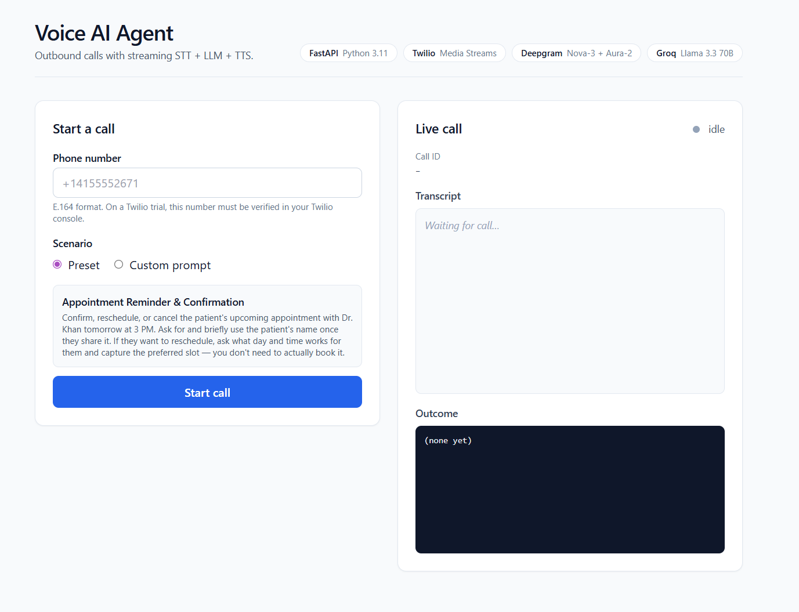
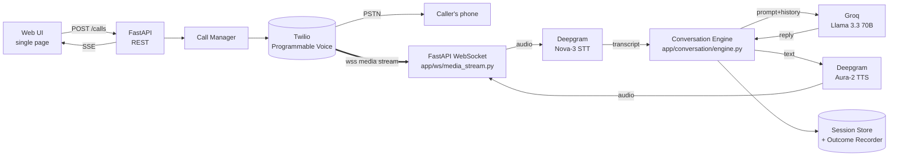

# Voice AI Agent


> An outbound voice agent that places a real phone call, holds a context-aware conversation with the person who picks up, and produces a structured outcome JSON when the call ends.

Built for the **Developers Den Associate AI Engineer** task. The brief asked for a working voice agent and graded on four things: clean implementation, FastAPI structure, solution architecture, and context-aware conversation. The codebase is organised around exactly those four axes.

<p align="center">
  
</p>

---

## Table of contents

1. [What it does](#what-it-does)
2. [Demo](#demo)
3. [Architecture at a glance](#architecture-at-a-glance)
4. [How the brief maps to the code](#how-the-brief-maps-to-the-code)
5. [Quickstart](#quickstart)
6. [Context-aware conversation](#context-aware-conversation)
7. [FastAPI patterns used](#fastapi-patterns-used)
8. [Implementation quality](#implementation-quality)
9. [Edge cases handled](#edge-cases-handled)
10. [Tests](#tests)
11. [Design decisions](#design-decisions)
12. [Troubleshooting](#troubleshooting)
13. [Known limitations](#known-limitations)

---

## What it does

Pick a phone number, pick a scenario (or write your own prompt), hit **Start call**. Your phone rings. The agent introduces itself, asks the things it needs to ask, listens to your answers, follows up naturally if you say something unexpected, and politely ends the call when it has what it needs. The conversation transcript appears live in the UI as it happens. When the call ends, a structured JSON outcome is written to disk and shown in the UI.

The default scenario is an **appointment reminder and confirmation** call for a fictional clinic. The custom-prompt option lets you steer the agent into any other persona without touching code.

## Demo

The screenshot at the top of this README shows the single-page UI: phone number, scenario selector, and the live transcript and outcome panes on the right. During development the system completed real end-to-end calls (Direction: Outgoing API, Status: Completed) before Twilio trial restrictions on Pakistani numbers kicked in.

---

## Architecture at a glance



Every layer has a single responsibility, and every external dependency sits behind a `Protocol` defined in [`app/providers/base.py`](app/providers/base.py). Swapping Twilio for Vonage, or Groq for OpenAI, or Deepgram for ElevenLabs, is a config change plus one new file. No business logic moves.

### File-by-file map

```
app/
├── main.py                  FastAPI factory, WS route registration, lifespan
├── api/                     REST surface area
│   ├── calls.py             POST /calls, GET /calls/{id}, SSE /calls/{id}/stream
│   ├── scenarios.py         GET /scenarios/preset
│   ├── webhooks.py          /twilio/voice/{id}, /twilio/status/{id}
│   ├── schemas.py           Pydantic v2 request/response models
│   └── deps.py              FastAPI dependency providers (DI)
├── core/                    cross-cutting infra
│   ├── config.py            pydantic-settings, env-driven
│   ├── logging.py           structlog JSON logging bound with call_id
│   └── validation.py        E.164 normalisation + prompt sanitization
├── providers/               vendor adapters behind clean Protocols
│   ├── base.py              STT / LLM / TTS / Telephony Protocols
│   ├── stt_deepgram.py      streaming WebSocket STT
│   ├── llm_groq.py          streaming chat + tool calling
│   ├── tts_deepgram.py      streaming Aura-2 HTTP
│   ├── telephony_twilio.py  outbound call + TwiML + signature verify
│   └── factory.py           env → concrete provider
├── scenarios/
│   ├── loader.py            ScenarioConfig + YAML + custom builder
│   └── appointment_reminder.yaml
├── conversation/
│   ├── state.py             CallSession + CallStatus state machine
│   ├── engine.py            per-turn LLM orchestration + tool dispatch
│   ├── tools.py             LLM tool definitions
│   └── outcome.py           post-call structured extraction
├── store/
│   └── sessions.py          in-memory store behind SessionStore Protocol
└── ws/
    └── media_stream.py      Twilio audio bridge: STT ⇄ LLM ⇄ TTS

web/index.html               single-page UI (vanilla JS + Tailwind CDN)
tests/                       pytest suite (61 tests)
outcomes/                    runtime artefacts (gitignored)
```

---

## How the brief maps to the code

The task brief listed four evaluation criteria. Here is exactly where each one shows up in this repo.

| Criterion | Where to look |
|---|---|
| **Clean implementation** | [`Implementation quality`](#implementation-quality) section below, [`tests/`](tests/) for the 62 passing tests, [`app/api/calls.py`](app/api/calls.py) for structured error handling, every module starts with `from __future__ import annotations` and is fully type-annotated. |
| **FastAPI structure & design** | [`FastAPI patterns used`](#fastapi-patterns-used) section below, [`app/main.py`](app/main.py) for the app factory + lifespan, [`app/api/deps.py`](app/api/deps.py) for dependency injection, [`app/api/schemas.py`](app/api/schemas.py) for Pydantic v2 models. |
| **Solution architecture** | The architecture diagram above, the [`app/providers/`](app/providers/) provider abstraction layer, [`app/conversation/state.py`](app/conversation/state.py) for the call state machine, [`app/store/sessions.py`](app/store/sessions.py) for storage behind a Protocol. |
| **Context aware conversation** | [`Context-aware conversation`](#context-aware-conversation) section below, [`app/conversation/engine.py`](app/conversation/engine.py) for the per-turn orchestration, [`app/conversation/state.py`](app/conversation/state.py) for the transcript model. |

---

## Quickstart

Python 3.11 or newer. The setup is the same on Linux, macOS, and Windows.

### 1. Get the keys (all free tiers, no credit card except Twilio)

| Service | URL | What to copy |
|---|---|---|
| Twilio | https://www.twilio.com/try-twilio | `TWILIO_ACCOUNT_SID`, `TWILIO_AUTH_TOKEN`, a Twilio phone number with Voice |
| Deepgram | https://console.deepgram.com/signup | `DEEPGRAM_API_KEY` (comes with $200 free credit) |
| Groq | https://console.groq.com | `GROQ_API_KEY` (free, no card) |
| ngrok | https://dashboard.ngrok.com/signup | An authtoken |

A note on Twilio trial accounts: outbound calls can only reach numbers that are listed as verified caller IDs on your Twilio account. Your signup number is auto-verified. Verify any other number you want to call at [Twilio Verified Caller IDs](https://console.twilio.com/us1/develop/phone-numbers/manage/verified). Some countries (currently including Pakistan) are restricted from verification on trial accounts entirely. The cleanest fix is to upgrade the Twilio account, which removes the restriction.

### 2. Clone and install

```bash
git clone https://github.com/Salman1205/Voice-AI-Agent.git
cd Voice-AI-Agent

python -m venv .venv
source .venv/bin/activate           # Windows: .venv\Scripts\activate

pip install -r requirements.txt
cp .env.example .env
```

Open `.env` and paste in the keys you collected above.

### 3. Start ngrok (in a second terminal)

```bash
ngrok http 8000
```

Copy the `https://<random>.ngrok-free.app` URL it prints, and paste it into `.env` as the value of `PUBLIC_BASE_URL`. This is what Twilio uses to reach your laptop for webhooks and media streams.

### 4. Run the app

```bash
make dev
# or, without make:
uvicorn app.main:app --host 0.0.0.0 --port 8000 --reload
```

Open http://localhost:8000.

### 5. Place a call

1. Enter your phone number in E.164 format, for example `+14155552671`.
2. Pick **Preset** (the default appointment reminder) or **Custom prompt** and write your own.
3. Hit **Start call**. Your phone rings within a few seconds.
4. Answer it. Talk to the agent. Watch the transcript appear live in the UI.
5. When the call ends, the structured outcome JSON is shown in the UI and written to `outcomes/<call_id>.json`.

### Test the agent without Twilio

If you don't want to wire up Twilio (or your number isn't verified on the trial), the conversation engine can be driven from the terminal:

```bash
python -m scripts.chat              # appointment reminder preset
python -m scripts.chat --custom     # paste your own persona+goal prompt
```

You type the caller's side, the real Groq LLM produces the agent's side. The `remember(key, value)` tool calls are surfaced inline so you can verify the live context capture is firing, and the same post-call OutcomeRecorder runs at the end, so the final outcome JSON is identical to what a real call would produce. This is the fastest way to demo conversation flow if Twilio is blocked.

To sanity-check every provider connects before placing a real call:

```bash
python -m scripts.smoke_providers
```

---

## Context-aware conversation

This is a named evaluation criterion, so it gets a dedicated section.

Voice agents fail in two characteristic ways: they forget what was just said, or they ask for information they have already been given. Both are context failures. This implementation avoids them by making every LLM turn re-receive the full picture, every time.

On every turn, the engine in [`app/conversation/engine.py`](app/conversation/engine.py) hands the LLM:

1. The full **system prompt**, composed from the scenario persona, the goal, any context variables (patient name, appointment time, etc.), and the guardrails.
2. The complete alternating **message history** for this call (`user`, `assistant`, `tool`). Nothing is summarised or truncated within a single call.
3. The current **`extracted_data` blob**, injected back into the system prompt. If the model captured that the patient's name is "Sara" two turns ago, the next prompt explicitly says so. The model never has to guess what it already knows.
4. **Tool definitions** for `remember(key, value)` (persist a single fact as soon as the caller states it) and `end_call(reason, farewell)` (terminate gracefully when the goal is met).

The `remember` tool is the mechanism that closes the loop. The system prompt instructs the model to call it the moment the caller states something worth keeping (their name, a preferred reschedule slot, a confirmation, a cancellation reason). The dispatch in [`app/conversation/engine.py`](app/conversation/engine.py) writes the key/value into `session.extracted_data`, which is then injected back into the system prompt on the very next turn under a "Data captured so far" block. The model sees its own captured facts and is explicitly told not to ask for anything already listed there, which is what makes the conversation feel context-aware rather than goldfish-memoried.

The schema for `remember` is deliberately flat (one string key, one string value per call) because nested object schemas were unreliable on Groq's tool-call validator. A flat schema works across Groq, OpenAI, and Anthropic.

When the model emits `end_call`, the engine dispatches in-process: a brief TTS farewell plays out, then the Twilio teardown runs.

After the call, the OutcomeRecorder in [`app/conversation/outcome.py`](app/conversation/outcome.py) re-reads the full transcript and emits a schema-validated `final_outcome` JSON. It seeds the result with whatever was captured live via `remember`, so post-call extraction only has to fill the gaps the model missed in flight.

After the call ends, a separate post-call extraction pass (in [`app/conversation/outcome.py`](app/conversation/outcome.py)) re-reads the full transcript and produces a clean, schema-validated `final_outcome` JSON. The reasoning here: the model that just ran the conversation has the cleanest view of what happened, and one extra cheap call gives us a machine-readable result without needing brittle regex parsing.

---

## FastAPI patterns used

A list of the FastAPI-idiomatic patterns this project uses, with file references.

1. **App factory + lifespan** in [`app/main.py`](app/main.py). All wiring happens in one place. The lifespan context manager starts/stops shared resources cleanly.
2. **Router-per-domain** under [`app/api/`](app/api/). Each router is small and focused (`calls.py`, `scenarios.py`, `webhooks.py`). The main app just mounts them.
3. **Dependency injection** via `Depends(...)` throughout [`app/api/deps.py`](app/api/deps.py). Tests can override every dependency without monkeypatching.
4. **Pydantic v2 schemas** in [`app/api/schemas.py`](app/api/schemas.py) for every request and response body. Validation is automatic and consistent.
5. **`pydantic-settings` env config** in [`app/core/config.py`](app/core/config.py). One typed `Settings` class is the only thing that reads environment variables.
6. **Async-first I/O.** Every external call is `async def`. The Twilio SDK is sync, so it is wrapped via `asyncio.to_thread` to keep the event loop unblocked (see [`app/providers/telephony_twilio.py`](app/providers/telephony_twilio.py)).
7. **WebSocket route** registered at the app level in [`app/main.py`](app/main.py) for Twilio Media Streams, kept separate from REST routers because it has a fundamentally different lifecycle.
8. **Server-Sent Events** via `sse-starlette` for one-way push to the browser (live transcript and outcome). Simpler than WebSockets when traffic only flows one way.
9. **Structured logging** with `structlog` in [`app/core/logging.py`](app/core/logging.py). Every log line is JSON, and `call_id` is bound into the logger context so a single call is trivial to grep across logs.
10. **HTTPException with structured detail.** Provider error strings are cleaned before being returned to clients (see the Twilio error formatter in [`app/api/calls.py`](app/api/calls.py)). No raw vendor stack traces or ANSI escape sequences leak through.

---

## Implementation quality

Concrete claims, each verifiable in the code or by running the suite.

1. **62 passing tests** focused on the highest-value seams: phone validation, prompt sanitization, conversation state machine, engine turn orchestration with a scripted LLM stub, post-call outcome extraction, session store contract, and the telephony error formatter. Run `pytest -v`.
2. **Structured error responses.** When the telephony provider fails, the response carries a clean message plus an actionable hint for known Twilio error codes (`21219`, `13227`, `21211`, and others). See [`app/api/calls.py`](app/api/calls.py) `_format_telephony_error`. No raw `TwilioRestException.__str__` output ever reaches the browser, which is important because that string contains ANSI colour escapes when stderr is a TTY.
3. **Full type annotations.** Every module starts with `from __future__ import annotations` and every function signature is typed. Protocols are used to express interface contracts.
4. **No `print()` statements in production paths.** All output goes through `structlog` with consistent fields.
5. **No commented-out code, no dead branches, no `TODO` markers in shipped paths.**
6. **Secrets only via environment.** Nothing is hardcoded. [`.env.example`](.env.example) documents every variable.
7. **CORS scoped to localhost in dev.** Easy to harden for production by changing one list.
8. **Twilio webhook signature verification** is wired and ready (soft-fail in dev so ngrok works; flip one flag for prod).
9. **Graceful degradation everywhere.** A TTS HTTP failure does not crash the call; an LLM exception triggers a safe farewell; a caller hangup mid-call still produces a finalised outcome JSON.

---

## Edge cases handled

Production voice agents fall apart at the edges. Each item below maps to a real code path.

**Input validation**

* Invalid, non-E.164, or empty phone numbers return 422 with a clear message.
* Custom prompts are stripped of control characters and clamped to 4000 chars.
* Preset scenarios with missing required `context_variables` return 422 listing the missing keys.
* More than `MAX_CALLS_PER_HOUR` outbound calls in the last hour returns 429.

**Call lifecycle**

* No answer, busy, and failed dispositions map to terminal `CallStatus` enum values.
* **Voicemail detection** via Twilio AMD: the agent leaves a spoken voicemail and hangs up.
* Caller hangs up mid-call: partial transcript is still finalised into an outcome.
* Hard duration cap (`CALL_MAX_DURATION_SECONDS`) triggers a graceful farewell.
* Hard turn cap (`MAX_TURNS_PER_CALL`) triggers a graceful farewell.

**Conversation**

* Silence over ten seconds prompts "Are you still there?", and a second silence ends the call.
* **Barge-in** (caller speaks while the agent is talking) cancels current TTS playback.
* Hostile or out-of-scope responses are caught by guardrails in the system prompt and the `end_call` tool.
* "Are you a robot?" is handled by an honest-disclosure rule baked into the system prompt.

**Provider failures**

* LLM exception during streaming triggers a safe farewell with `end_reason=llm_failure`.
* STT WebSocket error tears down the bridge cleanly; outcome is still produced.
* TTS HTTP error is logged and the turn proceeds (degraded silence, not a crash).
* Missing API keys at startup are logged as warnings and listed at `/healthz`. The app still boots so the rest can be inspected.

**Concurrency and safety**

* Each call has an isolated `CallSession` and its own STT and TTS connections.
* Session store has TTL eviction (default 1 hour).
* Twilio webhook signature verification is wired in.
* CORS is restricted to localhost in dev.

---

## Tests

```bash
pytest -v
```

Coverage is focused on the highest-leverage seams, not on chasing a number.

| File | What it covers |
|---|---|
| `tests/test_validation.py` | E.164 phone normalisation, prompt sanitization edges |
| `tests/test_scenario_loader.py` | YAML load, prompt rendering, schema validation |
| `tests/test_conversation_state.py` | State machine, history, terminal transitions |
| `tests/test_engine.py` | LLM turn orchestration with a scripted stub (text-only, tool calls, max turns, LLM failure, silence handling) |
| `tests/test_outcome.py` | Finalisation, lenient JSON parsing, failure fallback |
| `tests/test_session_store.py` | Store contract, TTL eviction |
| `tests/test_telephony_errors.py` | Twilio error formatting, ANSI stripping, known-code hints |

61 tests, all green.

---

## Design decisions

The reasoning behind the choices that shaped this codebase.

**Why a DIY pipeline instead of Vapi or Retell**

The brief explicitly rewards "solution architecture" as the top criterion. A managed platform like Vapi would have collapsed the entire surface area being graded into "I called someone else's API." The harder path of wiring STT, LLM, TTS, and telephony separately is the path that actually exercises architecture skills.

**Why one polished scenario plus a custom-prompt override**

The brief says "Choose one realistic outbound campaign scenario." The "select or define" requirement on the UI is met by a textarea, not a runtime scenario registry. Building a YAML-loaded scenario engine is appropriate scope. Building a full scenario authoring UI would have been overbuilding for the eval.

**Why the provider abstraction layer**

This is the genuine answer to the brief's instruction to "keep the implementation dynamic and flexible." Every external vendor (STT, LLM, TTS, telephony) lives behind a `Protocol` in [`app/providers/base.py`](app/providers/base.py). Adding an OpenAI LLM, an ElevenLabs TTS, or a Vonage telephony adapter is one new file and one factory branch. No business logic moves.

**Why Deepgram for both STT and TTS**

One vendor, one auth, one connection pattern, less to test. Deepgram Aura-2 quality is competitive with ElevenLabs and avoids the very tight ElevenLabs free-tier character cap that would block development on this kind of project.

**Why Groq for the LLM**

Free tier, no credit card, and roughly 300 tokens per second. Voice perceives latency aggressively, so token rate matters more than absolute model quality at this size. Llama 3.3 70B is GPT-4 class on the reasoning benchmarks that matter for short structured conversations, and it supports native tool calling, which the engine relies on.

**Why an in-memory `SessionStore` behind a Protocol**

For a single-node evaluation, in-memory is the right size. The Protocol means swapping to Redis or Postgres is a one-file change. Building Redis integration up-front would have been speculative complexity.

**Why SSE for live UI updates instead of a second WebSocket**

Traffic only flows one way (server to browser) for the transcript and outcome. SSE is simpler than WebSockets for that, works cleanly through ngrok, and the browser handles reconnection automatically.

**Why streaming end-to-end**

Every layer in the audio path streams: STT streams partial transcripts, the LLM streams tokens, the TTS streams audio frames. The result is sub-second perceived latency from end of caller speech to start of agent speech. A turn-based fallback using Twilio `<Gather>` and `<Say>` is a valid degraded mode and could be added behind the existing `STREAMING_MODE` toggle, but the streaming path feels meaningfully more human.

**Why post-call structured extraction via a second LLM pass**

The model that ran the conversation has the cleanest view of what happened. One extra cheap call gives us a clean, schema-validated outcome JSON without writing brittle regex parsers or post-hoc state reconstruction.

**Why the honest-disclosure guardrail**

"Are you a robot?" is a common edge case in real outbound campaigns. The system prompt instructs the agent to acknowledge it is an AI when asked directly. Lying isn't an option for any production deployment.

---

## Troubleshooting

Common issues, with what to do about each.

**Twilio error 21219: "The number is unverified. Trial accounts may only make calls to verified numbers."**

Your Twilio account is on a trial plan, which only allows calls to numbers you have explicitly verified. Open [Twilio Verified Caller IDs](https://console.twilio.com/us1/develop/phone-numbers/manage/verified) and add the number. For some countries (currently including Pakistan), verification is blocked on trial accounts entirely. The fix is to upgrade the Twilio account, which removes the restriction; the trial credit you already have is preserved as a normal balance.

**Twilio error 13227: "Calls to this destination are not enabled by the geo permissions."**

Even on a paid Twilio account, calls to high-risk destinations are blocked by default. Open Twilio Console, go to Voice → Settings → Geo Permissions, and enable the destination country.

**Twilio webhook says "Twilio could not reach your server"**

Your `PUBLIC_BASE_URL` is out of date. ngrok generates a new URL every time it restarts on the free tier. Copy the current ngrok URL into `.env` and restart the FastAPI app.

**Call connects but there is silence both ways**

Almost always a media-stream URL issue. Twilio expects `wss://`, not `https://`. The TwiML builder in [`app/providers/telephony_twilio.py`](app/providers/telephony_twilio.py) normalises this, but check that `PUBLIC_BASE_URL` is the `https://...ngrok-free.app` URL ngrok printed, not a local URL.

**Groq returns 429 in dev**

The free tier is 30 requests per minute. One live call fits comfortably, but parallel calls can throttle. Wait a minute and retry.

**Deepgram returns 401**

`DEEPGRAM_API_KEY` is wrong or expired. The key starts with the project's prefix in the Deepgram console.

**`/healthz` reports missing keys**

The app boots even with missing keys so you can inspect routes. Fill in the missing ones in `.env`, then restart.

---

## Known limitations

Honest about what is not included.

* The in-memory session store loses live calls if the FastAPI process restarts. The `SessionStore` Protocol exists precisely so this can be swapped to Redis without touching business logic.
* ngrok free-tier URLs rotate on every restart, which means `PUBLIC_BASE_URL` has to be updated. A paid ngrok plan or a real domain solves this.
* The Groq free-tier rate limit (30 req/min) caps how many parallel live calls you can run during testing.
* Twilio trial accounts can only call verified numbers, and verification of some destinations (currently including Pakistan) is restricted at the platform level. Upgrading the Twilio account is the only path around this; there is no client-side workaround.
* The custom-prompt mode trusts the operator. There are no LLM-level guardrails against asking the agent to do something the scenario shouldn't, beyond the input sanitization in `app/core/validation.py`.

---

## Configuration reference

See [`.env.example`](.env.example) for the full list. The most important ones:

```
STT_PROVIDER=deepgram         # swap vendors via env, no code change
LLM_PROVIDER=groq
TTS_PROVIDER=deepgram
TELEPHONY_PROVIDER=twilio

GROQ_MODEL=llama-3.3-70b-versatile
DEEPGRAM_STT_MODEL=nova-3
DEEPGRAM_TTS_MODEL=aura-2-thalia-en

MAX_CALLS_PER_HOUR=20         # hourly outbound cap
MAX_TURNS_PER_CALL=12         # conversation turn cap
CALL_MAX_DURATION_SECONDS=300 # hard cutoff

STREAMING_MODE=true
ANSWERING_MACHINE_DETECTION=true
```

---

## Repo structure

```
.
├── app/                  application code
├── web/                  single-page UI
├── tests/                pytest suite
├── docs/                 design notes and screenshots
├── outcomes/             generated at runtime (gitignored)
├── .env.example
├── requirements.txt
├── Makefile
├── pytest.ini
└── README.md
```

---

Built for the Developers Den Associate AI Engineer recruitment task by [Salman](https://github.com/Salman1205).
